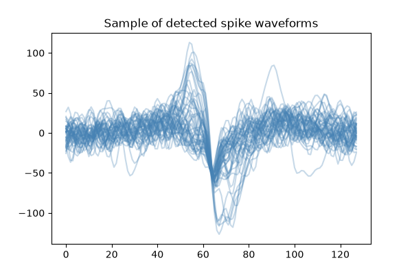
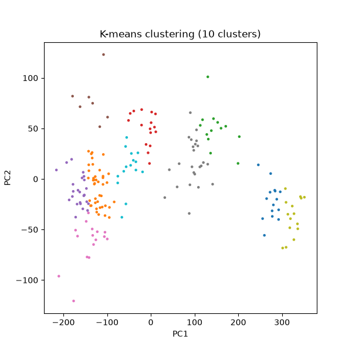

# fund-sort

A fundamental spike sorting pipeline for extracellular neural recordings.

## What is spike sorting?

When electrodes record electrical activity in the brain, they pick up overlapping signals from many nearby neurons at once. Spike sorting is the process of taking the raw, noisy signal and figuring out which spike came from which neuron.

## Pipeline

This project implements a standard spike sorting pipeline:

1. **Bandpass filtering** (300–6000 Hz) to isolate the frequency range
2. **Spike detection** based on thresholds
3. **Waveform extraction** around each detected spike
4. **PCA** to reduce each waveform to a basic feature representation
5. **K-means clustering** to group spikes by which neuron likely produced them
6. **Benchmarking against ground truth** to measure  detection accuracy

## Data

Used a 10-second  extracellular recording from [MEArec](https://github.com/alejoe91/MEArec), accessed through [SpikeInterface](https://spikeinterface.readthedocs.io/).

## Main finding: the precision/recall tradeoff

Detection threshold trades off precision against recall:

| Threshold factor | Precision | Recall |
|---|---|---|
| 4.5 | 98.5% | 17.9% |
| 4.0 | 96.8% | 24.2% |
| 3.0 | 62.4% | 40.2% |

## Results





## Setup

```bash
git clone git@github.com:rrajmanna/fund-sort.git
cd fund-sort
python3 -m venv venv
source venv/bin/activate
pip install -r requirements.txt
jupyter lab
```
